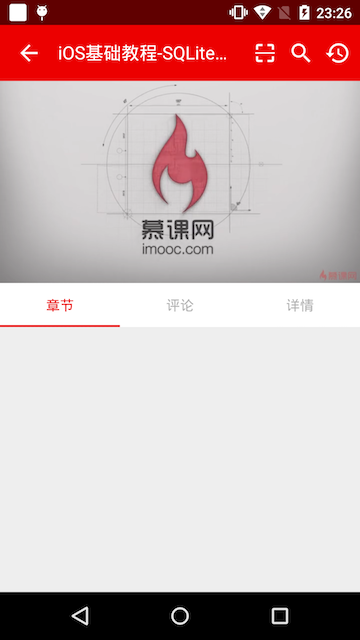

#第七天(2016.5.31)
　　今天把Vitamio给集成了，本来想用最新的5.0.1，因为5.0还是有问题的，例如我当时就遇到个很奇葩的问题，把编译目标设为23，结果在Android6.0上运行的时候出问题了，后来也是千找万找，终于在github上找到了个哥们也遇到了这个问题，把编译目标设置为22就OK了。那么我为什么不用5.0.1呢，在我编译后查看apk文件得12.4M，这也太大了，所以改成5.0的，编译后为9.6M，但是要注意编译目标给为22，不然6.0无法播放。这边在说下慕课网用的播放器是新浪网的开源项目，这个我还没用过，大家有机会可以试试。

　　接下来把视屏控制器好好改写下，该有的都添加上。

　　现在也是快期末了，上课，准备考试，还有其他项目，事情也是比较多，只能晚上写写这个代码，不过没关系的，贵在坚持，哪怕是每天只能写一点点，这个项目我总能够做完的。比如现在，我就有收获了啊，对Activity和Fragment的封装，之前我是都没有这样写过的，这样有什么好处呢，举个简单的例子，例如，我每个页面都要写个返回的动画，得重写finish()方法，还有得在onCreate()方法里面初始化ButterKnife，现在我把这个给封装下，然后继承下就OK了，代码又少了，我又会忘记去写几个东西，虽然难度不大，但是很经验，很细节，很方便。这些就是收获，相信到后面还有更多收获，加油，坚持，哈哈。

###截图
